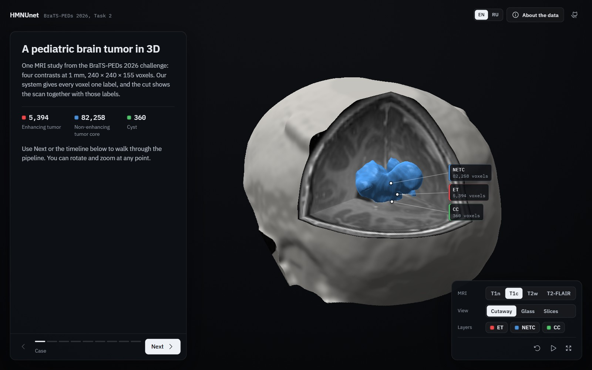
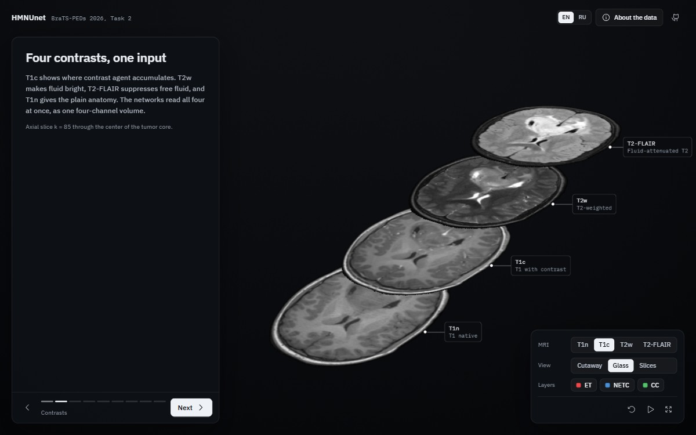
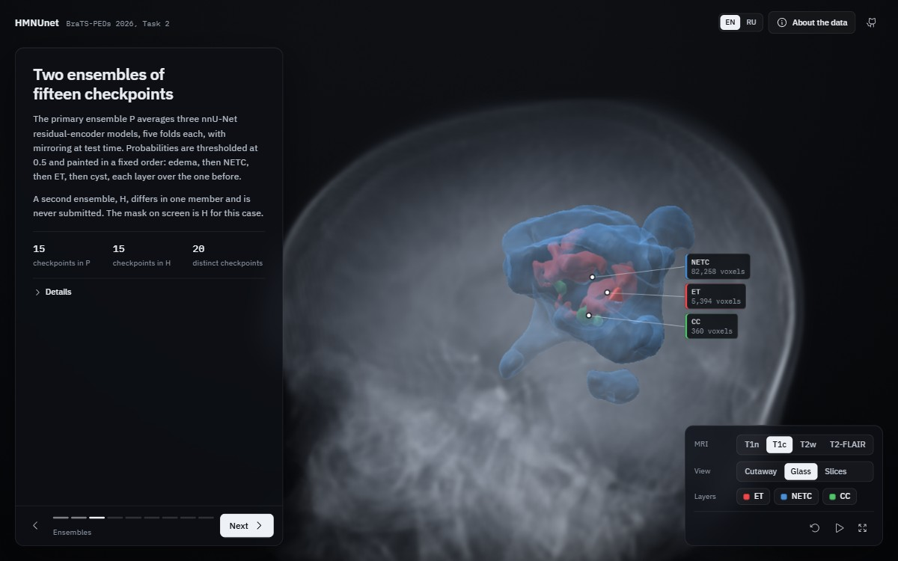
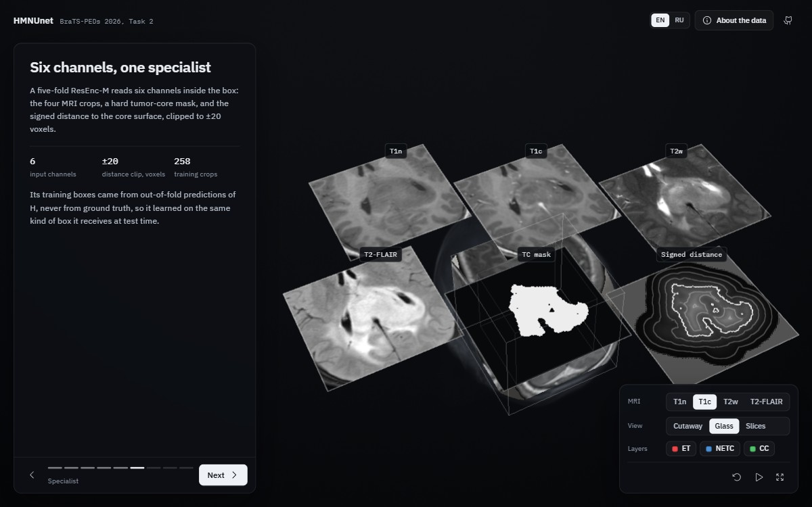
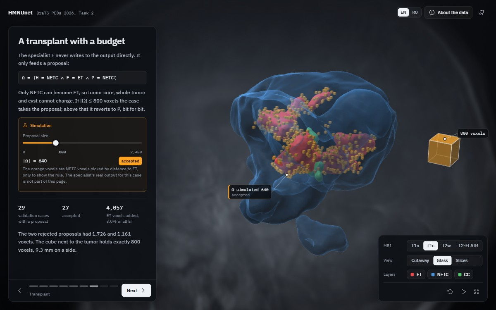

# BraTS 2026 3D explorer

Interactive 3D walkthrough of the HMNUnet pipeline for BraTS-PEDs 2026 Task 2
(code: https://github.com/1nqi/hmnunet-brats2026-task2), drawn on one real MRI case.

Made by team **HMNUnet** (Hari Mohan Rai, Dauren Omarbekov; Nazarbayev University, Astana,
Kazakhstan).

Nine chapters: the case, the four contrasts, the two ensembles, post-processing, the tumor-core
ROI, the six-channel specialist, the 800-voxel transplant, the terminal guard, and the verified
result. English and Russian. Free exploration at any point: cutaway, glass and slice views, all
four modalities, per-class layers.

## Preview

<p align="center">
  
</p>

<table>
  <tr>
    <td></td>
    <td></td>
  </tr>
  <tr>
    <td><sub>Four contrasts, one input</sub></td>
    <td><sub>Two five-fold ensembles, glass view</sub></td>
  </tr>
  <tr>
    <td></td>
    <td></td>
  </tr>
  <tr>
    <td><sub>Six channels for the specialist</sub></td>
    <td><sub>The 800-voxel transplant rule, shown with a marked simulation</sub></td>
  </tr>
</table>

## What is real and what is not

| On screen | Source |
|---|---|
| MRI volumes, BraTS-PED-00001-000 | challenge data, windowed to 8 bits |
| Tumor labels and surfaces | hybrid ensemble H from the RC1 container run (17 Jul 2026) |
| ROI box and signed distance | computed from that mask exactly as `bbox_from_tc` and `make_d503_crop` |
| Orange proposal voxels | **simulation**: NETC voxels ordered by distance to ET, labelled as such on the page |
| Metrics, digest, replay counts | published numbers from the repository README and paper |

No ground truth is shown, and the primary ensemble P and the specialist output F for this case
are not available, which is why the transplant chapter uses a marked simulation.

## Rebuild

Data (reads `C:\Users\user\Desktop\brats\test_input` and `test_output`, needs numpy, scipy,
scikit-image):

```bash
python tools/build_data.py
```

Vendored libraries:

```bash
cd tools && npm install && npm run vendor
```

Preview images in `docs/preview` (needs Google Chrome and the site running locally; pass its
address, the default is http://localhost:3217/):

```bash
node tools/capture_preview.mjs http://localhost:1234/
```

## Run locally

```bash
node site/server.js 1234 --dev
```

Then open http://localhost:1234. `--dev` re-reads files on every request and disables caching.
On localhost the page also exposes `window.hmnunet` for inspection. 1234 is just example port, 
you can choose any port you want tho.
